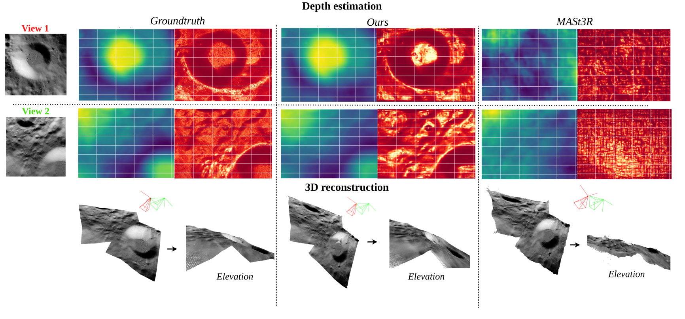
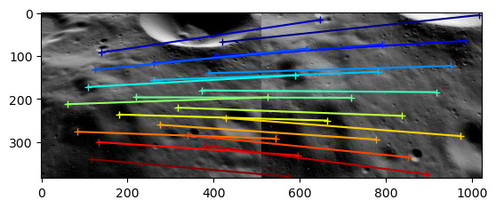
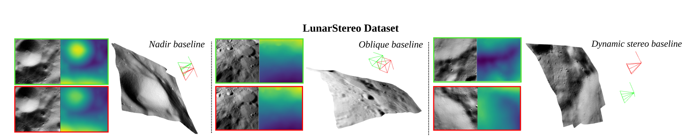

# MOONSt3R ICCV 3D-VAST 2025 
**Adapting Stereo Vision From Objects To 3D Lunar Surface Reconstruction with the StereoLunar Dataset**
*Accepted at ICCV 2025 (3D-VAST Workshop)*

<p align="center">
  
</p>

---

<p align="center">
  <a href="https://openreview.net/forum?id=l5sGAza3El"></a>
  <a href="https://clementinegrethen.github.io/publications/3D-Vast-ICCV2025.html"></a>
  <a href="#"></a>
</p>

---

## 🚀 News
**Coming Soon:** New model for 3D Moon reconstruction based on Vision Transformer (ViT) and StereoLunar dataset!

---

## 📦 Installation

### Prerequisites
- Python 3.11
- CUDA-compatible GPU (recommended)
- Git with submodule support

### Step-by-step Installation

**1. Clone the repository**
```bash
git clone --recursive https://github.com/clementinegrethen/MOONSt3R.git
cd MOONSt3R

# If you have already cloned without submodules:
# git submodule update --init --recursive
```

**2. Create and activate the environment**
```bash
conda create -n moonst3r python=3.11 cmake=3.14.0
conda activate moonst3r 
conda install pytorch torchvision pytorch-cuda=12.1 -c pytorch -c nvidia  # use the correct version of cuda for your system
pip install -r requirements.txt
pip install -r dust3r/requirements.txt
# Optional: you can also install additional packages to:
# - add support for HEIC images
# - add required packages for visloc.py
pip install -r dust3r/requirements_optional.txt
```

**3. Compile and install ASMK**
```bash
pip install cython
git clone https://github.com/jenicek/asmk
cd asmk/cython/
cythonize *.pyx
cd ..
pip install .
cd ..
```

**4. (Optional) Compile CUDA kernels for RoPE acceleration**
```bash
# DUST3R relies on RoPE positional embeddings for which you can compile some cuda kernels for faster runtime.
cd dust3r/croco/models/curope/
python setup.py build_ext --inplace
cd ../../../../
```

---


##  Checkpoints

There are two options for downloading our StereoLunar fine-tuned MASt3R model:

**Option 1: Automatic download via Hugging Face Hub**
The model ([MOONSt3R](https://huggingface.co/cgrethen/MOONSt3R)) will be downloaded automatically when you run the demo.

**Option 2: Manual download**
```bash
# Install gdown if needed
pip install gdown

# Create checkpoints directory and download model
mkdir -p checkpoints/
gdown --fuzzy "https://drive.google.com/file/d/11PjhqADOOXfIkLk64ognltVN-gUHxLHA/view?usp=drive_link" -O checkpoints/  # MOONSt3R.pth
```

##  Usage: Inference & Demo

### Sample Data
A folder with sample scenes from our **StereoLunar dataset** (see [Dataset Description](#-dataset-description)) for quick testing is provided: [`quick_testing/`](quick_testing/) *

### Demo Scripts

**Run interactive demo:**
```python
python demo.py --weights checkpoints/MOONSt3R.pth
```

**Run non-interactive demo:**
```python
python demo_mast3r_nongradio.py --weights checkpoints/MOONSt3R.pth
```
### 💡 Advanced Usage: Feature Matching

<details>
<summary><strong>Click to expand:</strong> Code sample to compute matches with MOONSt3R for a pair of images</summary>

```python
from mast3r.model import AsymmetricMASt3R
from mast3r.fast_nn import fast_reciprocal_NNs

import mast3r.utils.path_to_dust3r
from dust3r.inference import inference
from dust3r.utils.image import load_images

if __name__ == '__main__':
    device = 'cuda'
    model_name = "checkpoints/MOONSt3R.pth"  # Updated path
    # You can put the path to a local checkpoint in model_name if needed
    model = AsymmetricMASt3R.from_pretrained(model_name).to(device)
    
    # Load your images - replace with actual paths
    images = load_images(['path/to/img1.jpg', 'path/to/img2.jpg'], size=512)
    output = inference([tuple(images)], model, device, batch_size=1, verbose=False)

    # At this stage, you have the raw dust3r predictions
    view1, pred1 = output['view1'], output['pred1']
    view2, pred2 = output['view2'], output['pred2']

    desc1, desc2 = pred1['desc'].squeeze(0).detach(), pred2['desc'].squeeze(0).detach()

    # Find 2D-2D matches between the two images
    matches_im0, matches_im1 = fast_reciprocal_NNs(desc1, desc2, subsample_or_initxy1=8,
                                                   device=device, dist='dot', block_size=2**13)

    # Ignore small border around the edge
    H0, W0 = view1['true_shape'][0]
    valid_matches_im0 = (matches_im0[:, 0] >= 3) & (matches_im0[:, 0] < int(W0) - 3) & (
        matches_im0[:, 1] >= 3) & (matches_im0[:, 1] < int(H0) - 3)

    H1, W1 = view2['true_shape'][0]
    valid_matches_im1 = (matches_im1[:, 0] >= 3) & (matches_im1[:, 0] < int(W1) - 3) & (
        matches_im1[:, 1] >= 3) & (matches_im1[:, 1] < int(H1) - 3)

    valid_matches = valid_matches_im0 & valid_matches_im1
    matches_im0, matches_im1 = matches_im0[valid_matches], matches_im1[valid_matches]

    # Visualize matches
    import numpy as np
    import torch
    import torchvision.transforms.functional
    from matplotlib import pyplot as pl

    n_viz = 20
    num_matches = matches_im0.shape[0]
    match_idx_to_viz = np.round(np.linspace(0, num_matches - 1, n_viz)).astype(int)
    viz_matches_im0, viz_matches_im1 = matches_im0[match_idx_to_viz], matches_im1[match_idx_to_viz]

    image_mean = torch.as_tensor([0.5, 0.5, 0.5], device='cpu').reshape(1, 3, 1, 1)
    image_std = torch.as_tensor([0.5, 0.5, 0.5], device='cpu').reshape(1, 3, 1, 1)

    viz_imgs = []
    for i, view in enumerate([view1, view2]):
        rgb_tensor = view['img'] * image_std + image_mean
        viz_imgs.append(rgb_tensor.squeeze(0).permute(1, 2, 0).cpu().numpy())

    H0, W0, H1, W1 = *viz_imgs[0].shape[:2], *viz_imgs[1].shape[:2]
    img0 = np.pad(viz_imgs[0], ((0, max(H1 - H0, 0)), (0, 0), (0, 0)), 'constant', constant_values=0)
    img1 = np.pad(viz_imgs[1], ((0, max(H0 - H1, 0)), (0, 0), (0, 0)), 'constant', constant_values=0)
    img = np.concatenate((img0, img1), axis=1)
    
    pl.figure(figsize=(15, 8))
    pl.imshow(img)
    pl.title('Feature Matches between Lunar Surface Images')
    cmap = pl.get_cmap('jet')
    for i in range(n_viz):
        (x0, y0), (x1, y1) = viz_matches_im0[i].T, viz_matches_im1[i].T
        pl.plot([x0, x1 + W0], [y0, y1], '-+', color=cmap(i / (n_viz - 1)), scalex=False, scaley=False)
    pl.axis('off')
    pl.tight_layout()
    pl.show(block=True)
```

</details>

**Example Result:**

<!-- <p align="center">
  


---

## 🌙 Dataset Description

<p align="center">
  
</p>

Our dataset is provided in a format directly compatible with **DUSt3R/MASt3R training pipelines**.  
For each image, we include three synchronized files:

- **RGB image (`.jpg`)**  
  - Resolution: **512 × 512** pixels  
  - Standard 8-bit image for visualization and training.  
  - All images are expressed in a **selenocentric (Moon-centered) coordinate system**.

- **Depth map (`.exr`)**  
  - High-precision floating-point depth map (in meters).  
  - Encodes the distance from the camera to the visible surface for each pixel.  
  - Can be used to generate ground-truth 3D point clouds.

- **Camera metadata (`.npz`)**  
  - Contains the intrinsic and extrinsic calibration matrices:  
    - `intrinsics` (or `K`): 3×3 camera intrinsic matrix  
    - `extri` or `Rt`: 3×4 camera pose matrix (world→camera, OpenCV convention)  
    - Alternative fields (`fx`, `fy`, `cx`, `cy`) are also provided for compatibility.  
  - This ensures reproducible reprojections and geometric consistency.

---

## Data Structure

A typical folder looks like this:

```
dataset_root/
│
├── im_00000.jpg
├── im_00000.exr
├── im_00000.npz
│
├── im_00001.jpg
├── im_00001.exr
├── im_00001.npz
│
└── ...
```

Each triplet `{.jpg, .exr, .npz}` corresponds to a single camera frame.

---

## Data Generation

The StereoLunar dataset is available [here](<link_to_database>).

Each scene contains images in 512x512 `.jpg` format, paired with:
- `.npz` file: camera intrinsics and extrinsics
- `.exr` file: depth map in metric scale

Example data structure:

```
scene_001/
├── im_00000.jpg
├── im_00000.npz
├── im_00000.exr
├── im_00001.jpg
├── im_00001.npz
├── im_00001.exr
└── ...
```

In the repository, the folder **`DataGeneration/`** contains a **small example subset** of the dataset. This is meant for quick testing.

The dataset has been formatted to be **plug-and-play with DUSt3R/MASt3R**. We also provide (TODO) a **custom dataloader** that loads images, depth maps, and camera parameters in one call.

---

## DataLoader for LunarStereo

To train with the StereoLunar dataset, we provide a dataloader in [`mast3r/dust3r/dust3r/datasets/`](mast3r/dust3r/dust3r/datasets/) directly compatible with the format above. No preprocessing required.

Images are loaded as 512x512 `.jpg` files. Each view is paired with:
- a `.npz` file containing camera intrinsics and extrinsics
- a `.exr` file containing a depth map in metric scale

---

## 🧪 Quick Testing

A folder with sample scenes for quick testing will be provided: [`quick_testing/`](quick_testing/) *(to be created)*

---

## 🔧 Finetuning Example

To finetune on your own lunar dataset:

```python
# Example script
from mast3r.train import train
train(dataset_path='path/to/lunar_dataset', checkpoint='data_generation/mast3r/CHECKPOINTS/lunar_checkpoint.pth', ...)
```

---

## 📚 Citation

If you find this work useful, please cite:

> Grethen, C., Morin, G., Gasparini, S., Lebreton, J., Marti, L., & Gestido, M. S. (2025, October).  
> *Adapting Stereo Vision From Objects To 3D Lunar Surface Reconstruction with the StereoLunar Dataset.*  
> Accepted in **ICCV Workshops (3D-VAST 2025)**.

```bibtex
@inproceedings{grethen2025moonst3r,
  title={Adapting Stereo Vision From Objects To 3D Lunar Surface Reconstruction with the StereoLunar Dataset},
  author={Grethen, Clémentine and Morin, Géraldine and Gasparini, Simone and Lebreton, Jérémy and Marti, Lucas and Gestido, Manuel Sanchez},
  booktitle={Proceedings of the IEEE/CVF International Conference on Computer Vision Workshops (ICCVW)},
  year={2025},
  month={October},
  note={Accepted at 3D-VAST Workshop}
}
```

---

## 🙏 Acknowledgements

This codebase builds upon many excellent open-source projects, such as MegaDepth, DUSt3R, CroCo, etc. We thank the respective authors for making their work publicly available.

Special thanks to ESA and Airbus Defence and Space for their collaboration.

This work was supported by the **European Space Agency (ESA)** under contract **4000140461/23/NL/GLC/my**.

We gratefully acknowledge the valuable support and collaboration of the **European Space Agency (ESA)** and **Airbus Defence and Space**.
